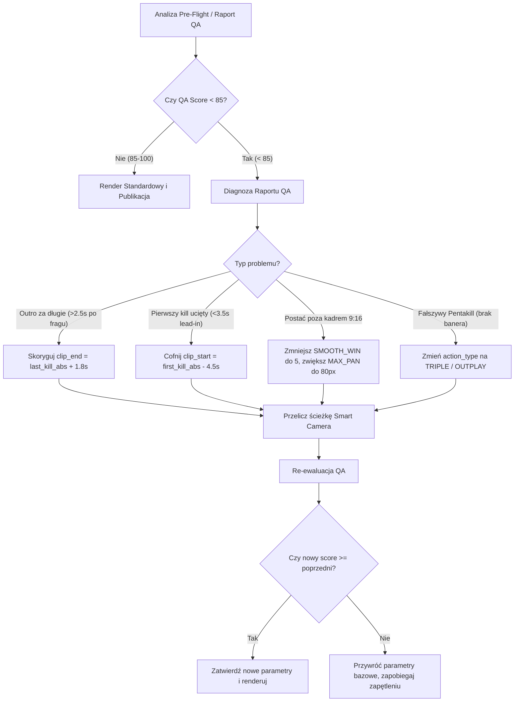

# LOL AGENT — MASTER CONTEXT (2026 PRODUCTION REVISION)
> Ostatnia aktualizacja: 2026-09-30 (Sesja: Phrase-Level Title Dedup, Eliminacja wycieku tagów z tytułu, Rozszerzenie puli szablonów CTR, Rzetelna klasyfikacja solo_bolo vs outplay przez liczenie wrogów CV, Backfill statusu publikacji)
> Wersja: v37 — PRODUKCYJNY PIPELINE + DEDUP FRAZOWY TYTUŁÓW + ENEMY BAR CLASSIFIER + DESKTOP STUDIO v25
> **CZYTAJ TEN PLIK NA POCZĄTKU KAŻDEJ SESJI — zastępuje analizę rozproszonych plików i chroni przed regresjami.**

---

## ⚡ ZASADY OSZCZĘDZANIA TOKENÓW (Dla modeli AI — Gemini Flash / Claude Opus / Sonnet)
```
✅ Odpowiadaj ZWIĘŹLE i technicznie — zero zbędnych wstępów i podsumowań ("Oczywiście!", "Świetnie!")
✅ Pokazuj tylko zmienione linie kodu z kontekstem 2-3 linii (diff), nigdy całe pliki
✅ Jeśli błąd/przyczyna jest znana — od razu wdrażaj naprawę i weryfikuj działanie
✅ Używaj view_file(StartLine, EndLine) z precyzyjnymi zakresami (max 50-100 linii na raz)
✅ NIE obniżaj parametrów jakościowych komputera (NVENC, 60fps, 1080x1920) — maszyna to High-End!
✅ Zanim zaczniesz sesję: zapoznaj się z sekcją 0, sekcją 1 (Złote Parametry) i sekcją 2 (Post-Mortem Błędów)
❌ Zakaz powtarzania tego, co użytkownik już widzi w logach lub na zrzucie ekranu
❌ Zakaz modyfikowania sprawdzonych parametrów kamery i pacingu bez uprzedniej weryfikacji w wytycznych
```

---

## 0. SZYBKI START & PROFIL SYSTEMU

> **Projekt**: Shortsyt — w pełni autonomiczny pipeline do montażu i publikacji pionowych YouTube Shorts (9:16) z klipów League of Legends.
> **Kanał produkcyjny**: [Dwannellenga (@dwannellenga471)](https://www.youtube.com/@dwannellenga471/shorts)
> **Ścieżka robocza**: `C:\Users\mz100\PycharmProjects\shortsyt\`
> **Środowisko Python**: `.\venv313\Scripts\python.exe`
> **Desktop Studio**: `C:\Users\mz100\PycharmProjects\shortsyt\shortsyt-desktop\` (Electron 32 + React 18 + Vite + TailwindCSS)
> **Główny backend API**: FastAPI na porcie `8765` (`lol_agent/api/main.py`)

### 🖥️ Profil Sprzętowy Komputera (High-End — WYNIK SKANU SYSTEMU):
Zgodnie z audytem `data/system_hardware_profile.json` system posiada dedykowane, mocne podzespoły:
- **Karta graficzna**: **NVIDIA GeForce RTX 3060 (12.0 GB VRAM)**
- **Procesor**: **Intel Core i5-10400F (12 wątków logicznych)**
- **Pamięć RAM**: **24.0 GB RAM (dostępne >10 GB)**
- **Enkoder FFmpeg**: **`h264_nvenc`** (preset `p5`, tune `hq`, cq `17`, render w **60 FPS / 1080x1920**)
- **Wydajność analityczna**: Pełny równoległy OCR (`max_ocr_workers: 12`, `ocr_sample_fps: 3.0`), aktywne ciężkie filtry.
> ⚠️ **DYREKTYWA SPRZĘTOWA**: Zakaz redukowania rozdzielczości, próbkowania klatek czy wyłączania filtrów kinowych pod pretekstem "oszczędzania zasobów". Komputer bez problemu renderuje short w 12–15 sekund w pełnej jakości 60FPS.

---

## 1. ZŁOTE PARAMETRY PRODUKCYJNE (ZWERYFIKOWANE — NIE RUSZAĆ)

### A. Kinematyka Kamery (`lol_agent/smart_camera.py`)
Kamera konwertuje materiał 16:9 (1920x1080) na wertykalny 9:16 (608x1080 przeskalowany do 1080x1920).
- **Detekcja paska gracza (Pure Player Tracking — ZERO wież/minionów)**: 
  - Maska koloru zielonego (standard): `(g > 130) & (r < 125) & (b < 120) & ((g - r) > 20) & ((g - b) > 25)`
  - Maska koloru złotego (colorblind): `(r > 160) & (g > 130) & (b < 115) & ((r - b) > 40) & ((g - b) > 15)`
  - Geometria paska bohatera: `18 <= cw <= 150`, `5 <= ch <= 18`, `2.0 <= asp <= 12.0`, `area >= 45`
  - **Odrzucanie wież**: Paski wież mają `cw > 180px` oraz wysoki asp — filtr `cw <= 150` i `asp <= 12.0` bezwzględnie eliminuje wieże.
  - **BRAK FALLBACKU NA WROGÓW**: Usunięto detekcję `enemy_cx` (czerwone paski), ponieważ płonące/niszczone wieże generowały czerwone artefakty, kradnąc kamerę na wieżę.
- **Maski wykluczeń (HUD / Overlays)**:
  - Scoreboard górny (precyzyjny): `excl[:95, 680:1240] = False` (nigdy `excl[:140, :]`, by nie maskować walk w rzece/krzakach!).
  - Dolny pasek skilli: `y > 864`
  - Minimapa i panel przedmiotów: `y > 626 oraz x > 1459`
  - Chat i portret gracza: `y > 670 oraz x < 345`
  - Portrety sojuszników HUD (prawe skrzydło): `excl[:450, 1540:] = False`
  - Marginesy boczne: `x < 45` oraz `x > 1740` (watermarki Outplayed/statystyki)
- **Parametry kinematyki kinowej**:
  - **`DEADBAND_PX = 30.0`**: Mikro-ruchy gracza w granicach 30px nie poruszają kamerą (stabilność statywu).
  - **`LERP_ALPHA = 0.45`**: Responsywne doganianie postaci podczas walki i po doskokach.
  - **`MAX_PAN_PX = 80`**: Maksymalny przesuw na próbkę.
  - **`SNAP_DELTA = 280`**: Natychmiastowy przeskok kamery przy Shunpo Katariny, Flashu lub skoku.
  - **`SMOOTH_WIN = 5`**: Segmentowane wygładzanie kroczące per-segment z wykrywaniem granic skoków (>180px).
  - **`MOMENTUM_FRAMES = 3` + `MOMENTUM_DECAY = 0.6`**: Gdy gracz chwilowo niewidoczny (VFX Death Lotus, obrót), kamera kontynuuje wektor prędkości z zanikaniem 60% przez max 3 klatki, po czym twardo zamraża pozycję (nigdy nie dryfuje na inne obiekty).
  - **`end_freeze_sec = 0.6`**: Zamrożenie pozycji kadru w ostatnich 0.6s klipu. Nigdy nie ustawiać 1.8s!

### B. Kadrowanie Czasowe & Pacing (`lol_agent/lol_frag_detector.py`, `PROJECT_GUIDELINES.md`)
- **Solo Bolo (1v1)**:
  - Klip od początku: `start = 0.0, end = 15.0` (brak ucinania setupu walki, zero jump-cutów).
  - Kolor miniatury: Crimson Red (`#DC2626`).
- **Multi-kill (Double, Triple, Quadra, Penta)**:
  - **Lead-in (bufor startowy)**: **`min 4.5s – 5.5s`** przed pierwszym fragiem (`lead_in = max(4.5, buildup * 4.0)`). Widz MUSI widzieć rozpoczęcie walki, doskok i wymianę skilli. Zakaz zaczynania klipu 1 sekundę przed fragiem!
  - **Outro (bufor końcowy)**: **`1.5s – 2.0s`** po ostatnim fragu. Wystarczające na przeczytanie banera i natychmiastowe przejście do zapętlenia.
  - **Slow-mo**: `0.7x` tylko na uderzenie wieńczące (finałowy frag). Zakaz przeciągłych spowolnień 0.4x trwających po 4 sekundy.

### C. Zbalansowanie Dźwięku (`lol_agent/lol_editor.py`, `lol_config.py`, `tuning_config.json`)
- **Normalizacja głośności (FFmpeg loudnorm)**:
  - Muzyka w tle (NCS/Phonk): `loudnorm=I=-17:TP=-1.5` (wyraźna, energetyczna, rytmiczna).
  - Dźwięk z gry (efekty, spelle, announcer): `loudnorm=I=-14:TP=-1.5` (wyraźny, głośny, dominant).
- **Proporcje miksu**:
  - `musicBalance = 0.60` (60% głośności muzyki)
  - `gameSoundBalance = 0.85` (85% głośności gry)
  - Sidechain ducking: -45% wyciszenia muzyki w momentach okrzyków announcera i killów.
- **Pętla Samouczenia z Korekt Użytkownika (`lol_agent/user_learning_memory.py`)**:
  - System śledzi każdą korektę suwaków w Desktop Studio, akceptację i odrzucenie filmu.
  - Zapisuje wyuczone preferencje w `lol_agent/user_feedback_history.json`.
  - Przyszłe rendery automatycznie adaptują parametry (muzyka, pacing, lead-in) bez konieczności ręcznego ustawiania.

### D. Combat Continuity Guard — Zakaz Wycinania Trwającej Walki
- **Zasada**: W klipach o łącznej rozpiętości `total_span <= 26.0s` lub w przerw między fragami zawierających wrogie paski HP / walkę, **jump-cut jest kategorycznie zablokowany**.
- **Cztery poziomy ochrony**:
  1. `pipeline_runner.py`: Jeśli `total_clip_span <= 26.0s`, wymusza `combat_segments = None`.
  2. `lol_frag_detector.py`: Próbkuje 5 klatek w luce między zabójstwami; jeśli występuje wymiana ognia lub `span <= 26.0s`, ustawia `allow_jump_cut = False`.
  3. `lol_quality_validator.py`: Wykrycie walki w luce anuluje sugerowane segmenty (`suggested_segments = None`), zapobiegając cięciom w locie.
  4. `lol_editor.py`: Ostatnia linia obrony w `render_short()` przed generowaniem listy FFmpeg concat sprawdza klatki luki i resetuje `combat_segments = None`.
- **Przypadek referencyjny**: Zabójstwo Jhina przykryte komunikatem "Your team destroyed the first turret!" w środku ekranu. OCR nie widział banera, ale Combat Continuity Guard zachował ciągłość wideo (24.5s) i wszystkie 3 zabójstwa znalazły się w finalnym shortsie.

### E. Tytuły, SEO & Deduplikacja Frazowa (`lol_agent/lol_metadata_generator.py`, `lol_agent/lol_publisher.py`)
- **Tylko `#Shorts` w tytule**: Zakaz wstrzykiwania `#LeagueOfLegends` czy `#LoL` do tytułu. Tytuł ma mieć mocny hook (<45 znaków) i wyłącznie `#Shorts` na końcu. Wszystkie pozostałe tagi i bloki wiralowe trafiają do opisu filmu (`_build_hashtags()`).
- **Deduplikacja frazowa (Fingerprint Guard)**: Ostatnie 15 opublikowanych filmów z `published_videos.jsonl` jest analizowane pod kątem odcisków pierwszych 3-4 słów (bez emoji i hashtagów). Szablony pasujące do odcisku otrzymują karę -85% wagi (`score * 0.15`), a Gemini dostaje listę `FORBIDDEN opening phrases`.
- **Rozszerzona pula szablonów CTR**: Każda kategoria akcji ma 12-16 unikalnych szablonów nasyconych słowami o najwyższym CTR z dyrektywy samouczenia (`WRONG`, `ENEMY`, `OUTPLAY`, `TRIED`, `EGO`, `SOLO`, `BOLO`) oraz wyczyszczonych ze słów zakazanych (`HUNT`, `ESCAPE`, `INSTANT`).

### F. Rzetelna Klasyfikacja Akcji (`lol_agent/lol_frag_detector.py`, `lol_agent/medal_db.py`)
- **`solo_bolo` vs `outplay`**:
  - Detektor zlicza wrogie paski HP w oknie walki (`_count_enemy_bars_in_frame()`).
  - Jeśli na ekranie podczas walki jest $\ge 2$ przeciwników (1v2, 1v3, teamfight/skirmish) $\rightarrow$ bezwzględnie **`outplay`**.
  - Jeśli OCR wykrył baner `SHUTDOWN`, `RAMPAGE`, `GODLIKE`, `KILLING SPREE`, `UNSTOPPABLE` $\rightarrow$ **`outplay`**.
  - Jeśli na klipie jest 0 killi (juke, ucieczka, contest smoka/barona) $\rightarrow$ **`outplay`**.
  - **`solo_bolo`** jest zarezerwowane wyłącznie dla pojedynków, gdzie na ekranie walczy dokładnie 1 wróg i padł dokładnie 1 kill bez shutdownu.
- **Medal DB Mapping**:
  - `MEDAL_TITLE_MAP` w `medal_db.py` mapuje `"solo kill"`, `"solo bolo"`, `"1v1"` na `solo_bolo`, a `"shutdown"`, `"outplay"`, `"1v2"`, `"1v3"`, `"ace"` na `outplay`.

---

## 2. POST-MORTEM AWARII: PRZYCZYNY I WYCIĄGNIĘTE WNIOSKI

W ostatnich sesjach wystąpiło 7 poważnych awarii / regresji. Poniżej zebrano ich dokładne źródło, aby żaden model AI nie powtórzył tych błędów:

### ❌ BŁĄD 1: Spóźniona kamera, ucięte pierwsze zabójstwo, kamera ucieka w prawo
- **Objaw**: Przy podwójnym/potrójnym zabójstwie pierwszy frag (np. rel 4.33s) jest ucięty z lewej strony, kamera dociera do akcji dopiero po 5-6 sekundach.
- **Źródło błędu (Root Cause)**:
  1. `SMOOTH_WIN = 13` w `smart_camera.py`: Na 80 próbek okno 13 uśrednia ruch z ponad 3.5 sekundy. Gdy gracz doskoczył na lewo (`x=124`), a kamera była w centrum (`x=903`), wykryto poprawny `SNAP_DELTA`, ale średnia krocząca z 13 próbek "rozmyła" ten skok i zamieniła go w powolny pan. Kamera na klatce fraga była dopiero na `crop_x=346` zamiast `crop_x=124`!
  2. `end_freeze_sec = 1.8s`: W klipie 10.5-sekundowym zamrożenie zaczynało się już w `8.7s`. Triple Kill w `9.33s` został zamrożony w starym kadrze przed uderzeniem!
- **Wniosek i Rozwiązanie**:
  - `SMOOTH_WIN = 5` zachowuje natychmiastową reakcję na skok (snap) i pozwala kamerze ustawić się w <0.4s.
  - `MAX_PAN_PX = 80` pozwala kamerze szybko podążać za ruchem w dynamicznych akcjach.
  - `end_freeze_sec = 0.6s` zamraża pozycję dopiero w trakcie outro, nigdy podczas walki.

### ❌ BŁĄD 2: Fałszywy wynik QA 35/100 ("Kill poza krawędzią kadru")
- **Objaw**: W zmontowanym wideo akcja była widoczna, ale raport QA krzyczał: `QA FAIL ✗ (35/100) — kill @ 14.3s centroid (250px) poza krawędzią kadru 9:16 (crop_x=361)`.
- **Źródło błędu (Root Cause)**:
  - W `lol_quality_validator.py` funkcja sprawdzała pozycję kamery: `crop_x = int(np.interp(kt, track_times, track_xs))`.
  - Zmienna `kt` to timestamp **bezwzględny** (np. `14.33s`, `19.33s`).
  - Natomiast `track_times` ze `smart_camera.find_action_path` to timestampy **względne** (np. `[0.0, 0.13, ..., 10.5]`).
  - Ponieważ `14.33 > 10.5`, funkcja `np.interp` ZAWSZE zwracała ostatnią wartość z tablicy `track_xs` (`361px` z outro freeze) dla każdego zabójstwa w klipie!
  - Następnie sprawdzała, czy kill o pozycji `x=250` mieści się w `[361, 969]`. Ponieważ `250 < 361`, validator fałszywie raportował błąd i obcinał ocenę o 30 punktów za każdego fraga!
- **Wniosek i Rozwiązanie**:
  - Normalizacja czasu zapytania w QA: `query_t = kt - adj_start` jeśli `track_times` jest relatywny (`track_times[0] < adj_start`). Teraz QA ocenia kadr dokładnie w chwili zabójstwa.

### ❌ BŁĄD 3: Skrócenie klipu do 2 sekund w pętli Auto-Retry
- **Objaw**: Po wdrożeniu auto-retry klip wyrenderował się o długości 1.83s (`0:00 / 0:02` w odtwarzaczu).
- **Źródło błędu (Root Cause)**:
  - W `pipeline_runner.py` timestampy w tablicy `peaks` to czasy względne od początku klipu (`[(4.33, 'DOUBLE KILL'), (9.33, 'TRIPLE KILL')]`).
  - Kod auto-retry pobierał `last_kill = 9.33` i liczył nowy koniec klipu jako: `clip_end = last_kill + 2.5 = 11.83s`.
  - Jednak parametr `clip_start` wynosił `10.0s` (czas bezwzględny z pliku źródłowego)!
  - Wynik: `clip_start = 10.0s`, `clip_end = 11.83s` -> klip trwał 1.83 sekundy!
- **Wniosek i Rozwiązanie**:
  - `last_kill_t_abs = clip_start + last_kill_t_rel`. Nowy `clip_end` wynosi `10.0 + 9.33 + 2.0 = 21.33s`.

### ❌ BŁĄD 4: Zbyt głośna muzyka zagłuszająca odgłosy gry
- **Objaw**: Muzyka dudniła w uszy, a okrzyków Katariny i announcera gry prawie nie było słychać.
- **Źródło błędu (Root Cause)**:
  - Obie ścieżki (gra i muzyka) miały ustawiony ten sam target głośności `-14 LUFS` w filtrze `loudnorm`.
- **Wniosek i Rozwiązanie**:
  - Muzyka musi być w tle: `I=-21:TP=-2.0` oraz balans 45%. Gra: `I=-14:TP=-1.5` oraz balans 85%.

### ❌ BŁĄD 5: Wycinanie środkowego zabójstwa przez jump-cut (brakujące zabójstwo Jhina)
- **Objaw**: Po pierwszym fragu (Warwick) kamera przeskakuje natychmiast do trzeciego (Double Kill), wycinając drugie zabójstwo (Jhin pod wieżą).
- **Źródło błędu (Root Cause)**:
  - Komunikat "Your team destroyed the first turret!" w centrum ekranu przysłonił baner OCR zabójstwa Jhina w klatkach 18-21s.
  - Powstała 11.5-sekundowa luka detekcji między OUTPLAY a DOUBLE KILL. Algorytm uznał to za "puste bieganie" i podzielił klip na 2 segmenty, wycinając trwającą walkę.
- **Wniosek i Rozwiązanie**:
  - Wdrożono `Combat Continuity Guard` (Sekcja 1.D) — weryfikacja pikseli walki w luce oraz limit `total_span <= 26.0s` blokują jump-cuty.

### ❌ BŁĄD 6: Kamera skacząca na wieżę i gubiąca gracza w trakcie walki
- **Objaw**: Kamera w trakcie walki przy wieży nagle blokuje się na wieży zamiast śledzić Katarinę i przeciwników.
- **Źródło błędu (Root Cause)**:
  - Płonąca lub niszczona wieża generowała czerwone piksele i miała szeroki pasek HP, który wygrywał w starym fallbacku wrogów (`enemy_cx`) oraz przy braku górnego limitu szerokości paska gracza (`cw`).
- **Wniosek i Rozwiązanie**:
  - Wdrożono dyrektywę `camera_player_only_tracking`: filtr paska bohatera `18 <= cw <= 150` (wieże mają >180px), bezwzględne usunięcie `enemy_cx` fallbacku. Kamera śledzi WYŁĄCZNIE championa gracza.

### ❌ BŁĄD 7: Statyczna kamera w centrum kadru (Unpack Bug w first_x search)
- **Objaw**: Po wdrożeniu zmian kamera w ogóle się nie ruszała, stała w miejscu (`crop_x = 656`), a bohater i cel uciekali poza kadr 9:16.
- **Źródło błędu (Root Cause)**:
  - Po zmianie struktury `frames_data` z krotek `(hp_bars, enemy_cx)` na płaską listę `hp_bars`, w linii 760 pozostało `for hp_b, _ in frames_data:`.
  - Pętla rzucała `ValueError: not enough values to unpack (expected 2, got 1)`, co cicho aktywowało `except Exception:` i zwracało statyczny fallback centrum `[(0.0, 656), (duration, 656)]`.
- **Wniosek i Rozwiązanie**:
  - Poprawiono na `for hp_b in frames_data:`. Wprowadzono testowanie `find_action_path()` przed i po restarcie backendu, weryfikując generowanie dynamicznych punktów zamiast 2-punktowego fallbacku.

### ❌ BŁĄD 8: Monotonia tytułów i zombie-tagi (#LeagueOfLegends) w tytule
- **Objaw**: Wszystkie tytuły kończyły się `#Shorts #LeagueOfLegends #LoL`, ucinając widoczną część tytułu na smartfonach, a nazwy typu "They Tried to Run" i "Master Tier SOLO BOLO" powtarzały się po 4 razy z rzędu w publikacjach.
- **Źródło błędu (Root Cause)**:
  1. `lol_publisher.py` siłowo doklejał `#LeagueOfLegends #LoL` w `upload_lol_short()` tuż przed wysłaniem do YouTube API.
  2. Dedup sprawdzał tylko pełne identyczne stringi tytułów, więc drobna zmiana emoji ignorowała blokadę powtórzeń.
  3. Pula szablonów miała zaledwie 6-8 pozycji per typ akcji i zawierała słowa z listy `avoid_keywords` (`HUNT`, `ESCAPE`, `INSTANT`).
- **Wniosek i Rozwiązanie**:
  - Usunięto doklejanie tagów w uploaderze (tylko `#Shorts` jako safety net).
  - Wdrożono deduplikację na poziomie odcisków frazowych (pierwsze 3-4 słowa bez emoji) z karą -85% wagi na pasujące szablony i listą `FORBIDDEN opening phrases` dla Gemini.
  - Rozszerzono bazę do 12-16 szablonów nasyconych słowami o wysokim CTR (`WRONG`, `ENEMY`, `OUTPLAY`, `TRIED`, `EGO`, `SOLO`, `BOLO`).

### ❌ BŁĄD 9: Wszystkie pojedyncze kille klasyfikowane fałszywie jako SOLO BOLO
- **Objaw**: Teamfighty, walki 1v2, shutdowny i klipy bez fraga były fałszywie oznaczane jako `solo_bolo` z czerwonymi banerami i tytułami 1v1. `outplay` nigdy się nie pojawiał w gotowych filmach.
- **Źródło błędu (Root Cause)**:
  - W `lol_frag_detector.py` warunek `elif len(kills_detected) <= 1 and max_kill_tier <= 1 and not is_clutch:` był sprawdzany przed `else: outplay`, co czyniło `outplay` kodem martwym i wymuszało `solo_bolo` na każdym 1-killowym i 0-killowym klipie.
- **Wniosek i Rozwiązanie**:
  - Dodano `_count_enemy_bars_in_frame()`. Jeśli w kadrze walki jest $\ge 2$ wrogów lub OCR wykrył baner SHUTDOWN/RAMPAGE/itp., klip jest uczciwie oznaczany jako `outplay`.
  - `solo_bolo` jest ściśle ograniczone do walk 1v1 (dokładnie 1 wróg w kadrze, brak banera shutdown).

---

## 3. PROTOKÓŁ DIAGNOSTYCZNY & SAMONAPRAWIAJĄCY SIĘ RENDER (AUTONOMOUS HEALING)

Gdy montaż wykazuje nieprawidłowości, pipeline oraz agent AI muszą kierować się poniższym drzewem diagnostycznym:



### Zasady korekt automatycznych:
1. **Maksymalnie 1 próba auto-retry**: Nigdy nie twórz nieskończonych pętli re-renderowania.
2. **Warunek zachowania**: Nowy zestaw parametrów zostaje przyjęty **tylko wtedy**, gdy nowy `qa_score` jest wyższy od poprzedniego.
3. **Czyszczenie dysku**: Po udanym re-renderze stary uszkodzony plik tymczasowy `.mp4` jest natychmiast usuwany.

---

## 4. ARCHITEKTURA SYSTEMU & DESKTOP STUDIO

### Komponenty:
- **`lol_agent/smart_camera.py`**: Silnik Computer Vision śledzący gracza w 1080p z wykorzystaniem maski złotej, odrzucaniem HUD, eliminacją szarpnięć i płynnym LERP.
- **`lol_agent/lol_frag_detector.py`**: Detekcja OCR kill-bannerów, obliczanie okien walki (`_calculate_trim_window`), klastryzacja starć.
- **`lol_agent/lol_editor.py`**: Generator skryptu FFmpeg: wertykalny crop 9:16, dynamiczny slow-mo 0.7x, sidechain audio ducking, dwuwarstwowy loudnorm, animowane overlaye i neon loop progress bar.
- **`lol_agent/lol_quality_validator.py`**: Strażnik jakości pre-flight i post-render (sprawdzanie widoczności fragów, czasu reakcji hooka, tempa akcji).
- **`lol_agent/api/pipeline_runner.py`**: Asynchroniczny kontroler montażu ze stanem maszyny, logami czasu rzeczywistego i pętlą auto-retry.
- **`shortsyt-desktop/`**: Interfejs Electron + React do zarządzania biblioteką, podglądu kadrów, monitoringu renderu i publikacji na YouTube.

### Kluczowe Komendy:
```powershell
# 1. Start aplikacji Desktop + API serwera (1-Click):
.\Uruchom_Shortsyt_Studio.bat

# 2. Manualny restart backendu w tle:
Get-Process python -ErrorAction SilentlyContinue | Where-Object { $_.MainWindowTitle -eq "" } | Stop-Process -Force
Start-Process -NoNewWindow -FilePath ".\venv313\Scripts\python.exe" -ArgumentList "-m uvicorn lol_agent.api.main:app --host 127.0.0.1 --port 8765"

# 3. Test zdrowia API:
Invoke-RestMethod http://127.0.0.1:8765/health

# 4. Przebudowa frontendu Desktop po zmianach w shortsyt-desktop/src/:
cd shortsyt-desktop; npm run build; cd ..
```

---

## 5. HARMONOGRAM PUBLIKACJI & BRANDING KANAŁU

- **Rytm**: 2 filmy dziennie (system publikuje w oknach szczytu oglądalności):
  - ☀️ **Poranek (08:30 CEST)**: Wczesny test algorytmiczny, gotowy na popołudniowy ruch.
  - 🌙 **Wieczór (18:30 CEST)**: Główny szczyt graczy PC w Europie i USA.
- **Opisy & SEO**: Stały szablon `build_description()` w `lol_metadata_generator.py` zawierający unikalny hook, branding kanału Dwannellenga, 3 wezwania do działania (CTA) oraz tagi: `#Shorts #LeagueOfLegends #LoL #Katarina`.
- **Miniaturka (Hero-Frame)**: 1080x1920 pobierana dokładnie w momencie `peak_moment + 0.8s` (gdy baner zabójstwa jest w pełni wyrenderowany na ekranie), z czarnym obrysem i podpisem championa.
