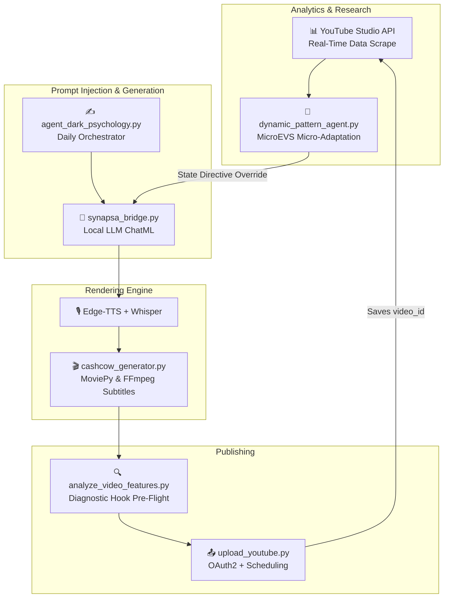

  <h1 align="center">📹 Shortsyt — Autonomous AI YouTube Shorts Factory</h1>
  

    <em>Autonomous pipeline that researches trends, generates scripts, renders videos, and publishes YouTube Shorts with a Real-Time Performance Adaptation Loop — zero human intervention.</em>
  

  

    
    
    
    
    
  

---

## 🎯 Case Study & Demo
> ⚠️ **CV / Showcase Focus:** This repository serves as a portfolio piece demonstrating advanced LLM Prompt Engineering, API Integration, and Autonomous Agent architectures.

* 📄 **[Read the Full Technical Case Study](case_study.md)**: Details the LLM Runtime Prompt Injection, MicroEVS Analytics, and the Hook Density diagnostic systems.
* 🎬 **[Watch the Auto-Generated Demo (MP4)](assets/demo.mp4)**: An example of an unedited, 100% AI-generated video created by the pipeline.

## 💡 Overview

**Shortsyt** is a fully autonomous content pipeline that handles the entire Shorts creation process end-to-end:

1. **🔍 Trend Analysis** — Scrapes YouTube for top-performing Shorts in target niches.
2. **✍️ AI Script Generation** — Bridges to a local LLM (Qwen 2.5 via Synapsa) to generate optimized scripts with a Hook-Trick-Warning structure.
3. **🎙️ Text-to-Speech** — Generates professional narration using Edge-TTS with per-word subtitle timing.
4. **🎬 Video Rendering** — Composites background footage, synced subtitles (with Hormozi-style keyword highlighting & animations), and background music.
5. **📤 Auto-Publishing** — Uploads to YouTube via OAuth2 with SEO-optimized titles, tags, and scheduled peak-time publishing.
6. **📊 Real-Time MicroEVS Loop** — The "Secret Sauce". Analyzes performance of published videos directly via the YouTube Analytics API and dynamically injects "Adaptation Directives" into the LLM prompt for the next video (e.g., forcing a hard-pivot if the previous hook failed).

---

## 🏗️ Architecture

---

## ⚙️ Key Architectural Features

### 🤖 Local LLM Orchestration
- Uses **Synapsa** to communicate directly with a locally running Qwen 2.5 Coder 7B.
- No cloud LLM keys required. Fully autonomous looping logic.
- "Deduplication Memory": Prohibits the LLM from outputting duplicate scripts using historical topics caching.

### 📐 Subtitle Metrics & Diagnostics
- Uses `analyze_video_features.py` to parse actual `.ass` subtitles pre-upload.
- Predicts Viewer Retention automatically by analyzing the "Hook Word Density." If a hook drops more than 12 words in the first 3 seconds, the agent aborts the upload to prevent algorithmic death.

### 🔥 Real-Time Adaptation (EVS)
- Standard AI generators suffer from "Mode Collapse". Shortsyt fights this using the `real_time_monitor_agent.py`.
- After a short is published, the agent tracks its exact Views Per Minute (VPM), Swiped Away %, and Engagement Factor.
- The LLM receives environmental overrides. (E.g., "The previous hook failed. EXPLORE State triggered. Abandon current storytelling style. Use fewer words.").

---

## 📂 Key Source Files (CV Core)

- `agent_dark_psychology.py`: The Main Brain orchestrating the 2-a-day loop and bridging the Real-Time Analytics override prompt.
- `dynamic_pattern_agent.py`: Calculates the mathematical performance baseline (MicroEVS) to determine LLM mutation strategy.
- `analyze_video_features.py`: Diagnostic logic preventing badly timed subtitles from killing retention.
- `cashcow_generator.py`: Merges background stock footage, audio normalization, and advanced subtitle styling programmatically.
- `upload_youtube.py`: Standard OAuth2 logic ensuring data posts accurately.

---

## 📜 Notice / Disclaimer
*Keys, OAuth profiles, un-rendered media (`music/`, `temp_videos/`, `videos/`), databases, and temporary caches have been omitted from this repository for security purposes. The code acts as a functional portfolio showcase.*
