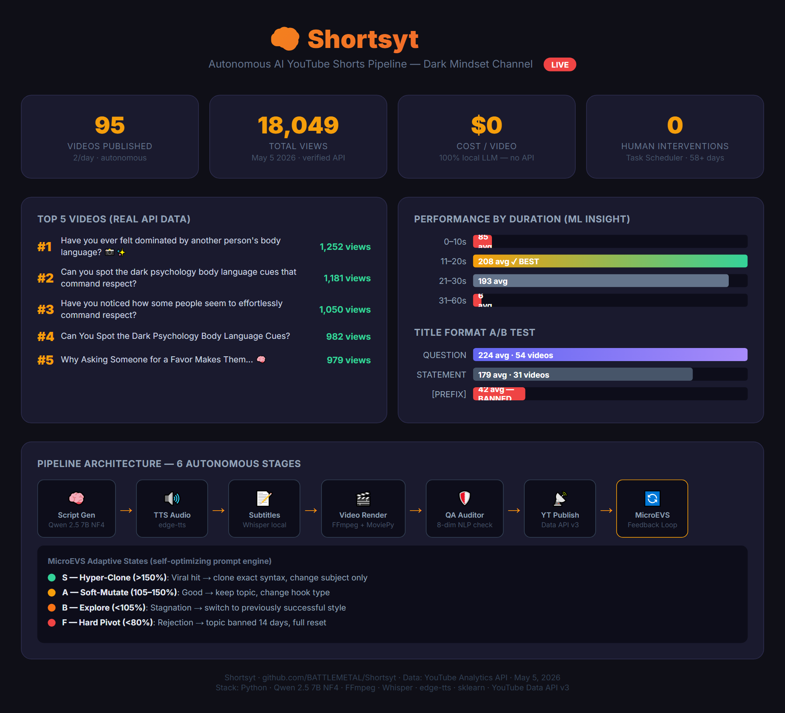

# Shortsyt — Autonomous YouTube Shorts Factory

[](.)
[](.)
[](https://youtube.com/@ItsDarkMindset/shorts)
[](.)
[](.)
[](./)

> **Autonomous content pipeline experiment.** Researched YouTube trends, generated psychology scripts via local LLM (Qwen 2.5 7B), audited quality with an 8-dimensional NLP scorer, rendered video with TTS narration, and published to YouTube — fully unattended. Ran for 73+ days producing 95 videos and 18,049 views at $0/video.

## 📊 Live Production Dashboard



> Data source: YouTube Analytics API (verified) · May 5, 2026 · 95 videos published · 18,049 total views · $0/video

---

## 📊 Live Production Results

| Metric | Value |
|---|---|
| Channel | [📺 Dark Mindset](https://youtube.com/@ItsDarkMindset/shorts) |
| Production start | March 3, 2026 |
| Videos published | **95+** (daily pipeline, Task Scheduler, **2 published today**) |
| Total views | **18,049+** |
| Top video views | **1,251** — "Have you ever felt dominated by another person's body language?" |
| Best avg. view duration | **85.4%** (12-second short — nearly complete watch) |
| Optimal title format | QUESTION format: **287 avg views** vs [PREFIX] format: **42 avg views** (**6.8× difference**) |
| Optimal duration | 11–20s shorts: **222 avg views** (best performing bracket) |
| Best publish time | Tuesday, ~19:00 UTC |
| **Cost per video** | **$0** (Edge-TTS + local Qwen 2.5 + Whisper, fully offline) |

### Top 5 Videos (as of April 13, 2026)

| Title | Views | Avg View % | Duration |
|---|---|---|---|
| "Have you ever felt dominated by another person's body language?" | **1,251** | 72.9% | 14s |
| "Can you spot the dark psychology body language cues that command respect?" | **1,180** | 59.1% | 16s |
| "Have you noticed how some people seem to effortlessly command respect?" | **1,047** | 44.5% | 23s |
| "Can You Spot the Dark Psychology Body Language Cues...?" | **981** | 72.8% | 12s |
| "Are You Being Controlled By These Dark Psychology Tactics?" | **903** | 85.4% | 12s |

> **Key insight derived by the pipeline's own analytics:** QUESTION-format titles outperform [PREFIX_BRACKET] titles by **6.8×**. This finding was automatically detected by `smart_video_analyzer.py` and injected as a constraint into Qwen 2.5's generation prompt.

---

## 🏗️ System Architecture

```
┌─────────────────────────────────────────────────────────────────────┐
│                    SHORTSYT PIPELINE                                │
│                                                                     │
│  1. YouTube Trends API  ──►  Topic Research & Competitor Analysis  │
│                                      │                              │
│  2. Synapsa Bridge IPC  ◄────────────┘                             │
│     (VRAM check → subprocess → Qwen 2.5 7B NF4)                    │
│                │                                                     │
│                ▼                                                     │
│  3. Quality Auditor  ──►  8-dimensional NLP Scoring Engine          │
│     [PASS ≥65] → continue   [FAIL] → regenerate / use fallback     │
│                │                                                     │
│                ▼                                                     │
│  4. MicroEVS Feedback  ──►  Real-time YouTube Analytics            │
│     (velocity score → dynamic prompt injection)                     │
│                │                                                     │
│                ▼                                                     │
│  5. Video Renderer  ──►  FFmpeg + Edge-TTS + Whisper subtitles     │
│     (Hormozi-style pop-zoom animations, silence removal)            │
│                │                                                     │
│                ▼                                                     │
│  6. YouTube Data API v3  ──►  OAuth2 Auto-Publish                  │
│                │                                                     │
│                ▼                                                     │
│  7. Analytics Loop  ──►  smart_analysis_*.json  ──►  Adaptation    │
└─────────────────────────────────────────────────────────────────────┘
```

---

## 🔬 Key Technical Features

### Quality Auditor (`quality_auditor.py` — 718 lines)

The core of the pipeline's reliability. Every generated script passes through an 8-dimensional scoring engine before rendering:

| Dimension | Max Points | What It Checks |
|---|---|---|
| Title | 20 | Format validation, length, emoji presence, forbidden patterns |
| Script | 30 | Word count (40-65), structure completeness, readability |
| Hook | 15 | PRE-HOOK + QUESTION HOOK + RE-HOOK + CTA presence |
| Uniqueness | 15 | SequenceMatcher deduplication vs. 50+ video history |
| Technical | 10 | Video duration via ffprobe (hard reject < 8s → score -999) |
| Keywords | 10 | Niche keyword density and relevance |
| Trend | 10 | Alignment with current YouTube search trends |
| AI Penalty | -15 | Detects hallucination phrases: "delve into", "embark on", "in conclusion" |

**Deduplication thresholds:**
- `> 0.50` similarity ratio → **hard reject** (script cannot be used)
- `> 0.35` similarity ratio → **soft penalty** (score reduced)

---

### Real-Time Adaptation Engine (`real_time_monitor_agent.py` + `dynamic_pattern_agent.py`)

Shortsyt doesn't just create videos — it evolves based on live performance data. The **MicroEVS (Early Velocity Score)** system:

```
MicroEVS = VPM_60 × (viewed_pct / swiped_pct) × engagement_factor
```

Based on the score, the system injects a prompt directive into Qwen 2.5 via env var:

| State | MicroEVS | Action |
|---|---|---|
| 🟢 **Hyper-Clone** (S) | > 150% | Clone exact hook syntax — change only the subject |
| 🟡 **Soft-Mutate** (A) | 105–150% | Keep topic, switch hook type (question → statement) |
| 🟠 **Explore** (B) | < 105% | Abandon hook, explore previously successful style |
| 🔴 **Hard Pivot** (F) | < 80% | Topic banned to `quarantine.json` (14-day timeout) |

Anti-fatigue guard: if State S triggers 3× in a row → forced Hard Pivot regardless of score.

---

### Synapsa IPC Bridge (`synapsa_bridge.py` — 493 lines)

Shortsyt runs in a lightweight venv. When AI generation is needed, it cross-venv calls the heavy Synapsa environment (PyTorch, transformers, PEFT, bitsandbytes):

```python
def generate_viral_script_with_synapsa(viral_context, niche_topic, ...):
    # 1. Guard: check VRAM before loading model
    if not _check_vram_available(min_gb=4.5):   # nvidia-smi query
        return use_fallback_script()

    # 2. Pass large payloads via env vars (Windows arg-length limit workaround)
    os.environ["SYNAPSA_CONTEXT_PAYLOAD"] = "||".join(viral_context)

    # 3. Cross-venv subprocess call with 5-minute timeout guard
    result = subprocess.run(
        [SYNAPSA_PYTHON, "synapsa_bridge.py", "--action", "script"],
        timeout=300,
        capture_output=True
    )
    # 4. Parse JSON from stdout (last valid line)
    return json.loads(result.stdout.strip().split('\n')[-1])
```

Fallback chain: Synapsa (Qwen 2.5) → 30 curated fallback scripts (cross-session deduplicated).

---

### Diagnostic Pre-Flight (`analyze_video_features.py`)

Before every upload, an internal auditor intercepts the `.mp4`:
- Resolution validation: requires 9:16 vertical
- Duration check (rejects < 8 seconds)
- **Hook density calculation:** parses subtitle `.ass` file to the 3-second mark — if opening >12 words → upload halted ("Swipe Away" risk)

---

### Persistent State

```
accounts/
├── topic_history.json           # 50+ video topic dedup database
├── used_fallbacks.json          # Cross-session fallback tracker
└── smart_analysis_*.json        # Daily channel analytics (24 files)

video_success_model.pkl          # 376KB trained sklearn view predictor
model_stylu.pkl                  # 162KB style model
```

Session-level dedup via env var `_SESSION_SCRIPTS_{PROFILE}` — Film 2 cannot reuse Film 1's script in the same daily run.

---

## 📂 Project Structure

```
shortsyt/                         174 files total
├── agent_dark_psychology.py      1,121 lines — main pipeline orchestrator
├── quality_auditor.py              718 lines — 8-dim NLP quality engine
├── synapsa_bridge.py               493 lines — IPC bridge to Qwen 2.5
├── cashcow_generator.py            555 lines — video render engine (FFmpeg + MoviePy)
├── real_time_monitor_agent.py      248 lines — YouTube Analytics scraper
├── dynamic_pattern_agent.py        213 lines — MicroEVS prompt injector
├── smart_video_analyzer.py         ~38K      — channel intelligence engine
├── facts_database.py               ~40K      — curated psychology facts DB
├── accounts/
│   ├── topic_history.json          Deduplication database
│   └── smart_analysis_*.json       31 days of channel analytics
├── video_success_model.pkl         Trained sklearn classifier (376KB)
└── publish_report.json             Full history of 87+ published videos
```

---

## 🛠️ Tech Stack

| Component | Technology |
|---|---|
| Script AI | Qwen 2.5 7B (NF4 4-bit) via Synapsa IPC |
| Script Fallback | 30 curated scripts (cross-session deduplicated) |
| TTS | Microsoft Edge-TTS (offline, zero API cost) |
| Subtitles | OpenAI Whisper (local) → `.ass` with pop-zoom sync |
| Video Render | FFmpeg + MoviePy + Hormozi-style word animations |
| Upload | YouTube Data API v3 + OAuth2 |
| Analytics | YouTube Analytics API v2 + sklearn view predictor |
| Quality Gate | Custom NLP scorer (SequenceMatcher + ffprobe) |
| Scheduling | Windows Task Scheduler (daily 13:30) |

---

## 🔄 Running in Production

```bash
# Runs automatically via Windows Task Scheduler at 13:30
start_daily.bat

# Manual run
python agent_dark_psychology.py

# Analytics only (no render/upload)
python smart_video_analyzer.py --analyze-only
```

**Prerequisites:**
- Synapsa in separate venv at `C:\...\Synapsa\venv\` (optional — fallback scripts work without it)
- YouTube OAuth2 credentials in `client_secrets.json`
- NVIDIA GPU with ≥4.5 GB free VRAM (checked automatically via `nvidia-smi`)

---

## ⚙️ Integration with Synapsa

This project is one half of a two-system architecture. The AI backend is [Synapsa](https://github.com/BATTLEMETAL/Synapsa-Local-LLM-Agent) — a multi-agent platform running Qwen 2.5 7B locally with NF4 quantization.

Shortsyt calls Synapsa via subprocess IPC when VRAM is sufficient. When VRAM is occupied (e.g., by a game), the pipeline falls back automatically to curated scripts — maintaining daily publishing without any human intervention.

---

## 🔒 Cost & Privacy

| Item | Cost |
|---|---|
| TTS narration | $0 (Edge-TTS, offline) |
| Script generation | $0 (local Qwen 2.5, offline) |
| Subtitles | $0 (local Whisper) |
| Video render | $0 (FFmpeg/MoviePy) |
| YouTube upload | $0 (YouTube Data API free quota) |
| **Total per video** | **$0** |

User content and scripts are never sent to external services. OAuth2 is the only credentialed external call.

---

*Part of the Synapsa + Shortsyt inter-process AI system. See [Synapsa-Local-LLM-Agent](https://github.com/BATTLEMETAL/Synapsa-Local-LLM-Agent) for the AI backend.*
