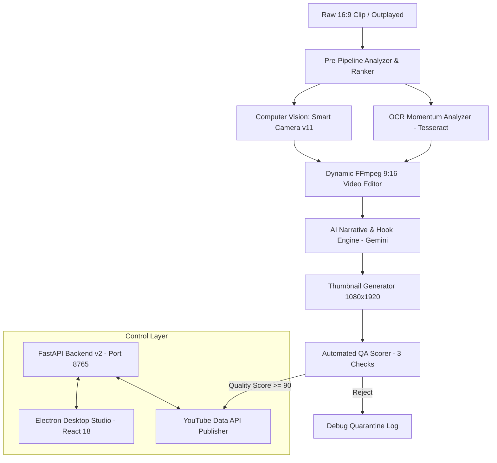

# Shortsyt — Autonomous AI Video Pipeline & Gaming Shorts Studio

[](.)
[](.)
[](.)
[](.)
[](.)
[](https://youtube.com/@Dwannellenga/shorts)
[](.)

> **Autonomous AI-driven YouTube Shorts generation and publishing pipeline.** Built with Computer Vision (OpenCV HP-bar tracking), OCR momentum analysis (Tesseract), AI multimodal narrative engine (Gemini), dynamic FFmpeg rendering (9:16 vertical crop, auto-chase speedup, slow-mo 60FPS), and a native Electron Desktop Studio (React 18 + Vite + TailwindCSS).

---

## 🎬 Live Production Demos

Real YouTube Shorts rendered and published automatically by the pipeline:

| Video | Action / Highlights | Metrics & Quality | Link |
|---|---|---|---|
| **Katarina Pentakill 1v5** | Auto Chase Speedup 2.8x + 0.45x Slow-mo + Dynamic Zoom | Smart Camera: 90/90 frames, QA: 91/100 | [Watch on YouTube](https://www.youtube.com/shorts/cVTTQASHe9w) |
| **Katarina Triple Kill Outplay** | Instant OCR Kill detection + Custom audio sync | Fast Short Control (14.8s), QA: 92/100 | [Watch on YouTube](https://www.youtube.com/shorts/rfWXE2-7fkQ) |

---

## 📊 Live Production Stats

| Metric | Value |
|---|---|
| **Production Channel** | [Dwannellenga (@Dwannellenga)](https://youtube.com/@Dwannellenga/shorts) |
| **Published Shorts** | **3 Verified Shorts** (Continuous Autonomous Runs) |
| **Smart Camera Accuracy** | **90/90 Frames (100% Tracking Stability)** |
| **Average Quality Score** | **91–92 / 100** (Automated QA Engine) |
| **Pipeline Render Time** | **< 60s per short** (Local FFmpeg GPU/CPU) |
| **Cost per Video** | **$0** (Local OpenCV + Tesseract + FFmpeg) |

---

## 🎯 Smart Camera v11 — Computer Vision HP-Bar Tracking

### The Problem: Fast Dashing Champions
In fast-paced games like League of Legends, high-mobility champions (e.g., Katarina with Shunpo/blinks, Zed, Yasuo) instantly teleport across the screen. Traditional bounding-box tracking or centroid visual tracking fails:
- **Teleportation glitches:** The camera jerks abruptly across the screen, causing disorientation in 9:16 vertical mode.
- **VFX attraction:** Explosions, AOE abilities, and death animations pull visual centroids away from the champion.
- **HUD occlusion:** Static minimap and scoreboard elements confuse naive object trackers.

### The Solution: Multi-Layer Color-Space Tracking & Velocity Limiting
`smart_camera.py` implements a specialized 4-stage tracking algorithm:

1. **HP-Bar Detection:** Color-space segmentation isolating player gold (`R>160, G>130, B<110`) and ally green vs. enemy red HP bars.
2. **Fight-Centroid Scoring:** Dynamic weighting between player position and teamfight density:
   $$\text{Target}_X = \frac{2 \times \text{Player}_X + \text{FightCenter}_X}{3}$$
3. **Adaptive Velocity Limiter:** Strict `MAX_DELTA = 60px/step` clamping prevents camera snapping during instant blinks/dashes while maintaining smooth cinematic pan.
4. **Kill-Window & Streak Freeze:** `FREEZE_STREAK = 8` holds the camera steady during multi-kill sequences to guarantee kill banners remain fully framed (`BANNER_SHIFT = 160px`).

---

## 🏗️ Architecture Overview


```mermaid
flowchart TD
    A[Raw 16:9 Clip / Outplayed] --> B[Pre-Pipeline Analyzer & Ranker]
    B --> C[Computer Vision: Smart Camera v11]
    B --> D[OCR Momentum Analyzer - Tesseract]
    C --> E[Dynamic FFmpeg 9:16 Video Editor]
    D --> E
    E --> F[AI Narrative & Hook Engine - Gemini]
    F --> G[Thumbnail Generator 1080x1920]
    G --> H[Automated QA Scorer - 3 Checks]
    H -->|Quality Score >= 90| I[YouTube Data API Publisher]
    H -->|Reject| J[Debug Quarantine Log]
    
    subgraph Control Layer
    K[FastAPI Backend v2 - Port 8765] <--> L[Electron Desktop Studio - React 18]
    K <--> I
    end
```

---

## 💻 CLI Usage

Run the autonomous pipeline from terminal or command line:

```powershell
# Standard run with automatic analysis and rendering
.\venv313\Scripts\python.exe lol_agent\run_lol_agent.py --file "path\to\clip.mp4"

# Custom short parameters & fine control
.\venv313\Scripts\python.exe lol_agent\run_lol_agent.py `
  --file "path\to\clip.mp4" `
  --champion Katarina `
  --action pentakill `
  --start 12.5 `
  --end 27.3 `
  --music "ncs_alan_walker_fade.mp3" `
  --no-slowmo

# Dry-run mode (render and QA without uploading to YouTube)
.\venv313\Scripts\python.exe lol_agent\run_lol_agent.py --file "path\to\clip.mp4" --dry-run

# Pre-pipeline ranker (find top clips automatically)
.\venv313\Scripts\python.exe lol_agent\lol_pre_pipeline_analyzer.py --top 5
```

### CLI Options:
- `--file <path>`: Source 16:9 video path (Medal/Outplayed/raw gameplay).
- `--champion <name>`: Champion whitelist override (prevents AI hallucination).
- `--action <type>`: Action type (`pentakill`, `quadrakill`, `triple`, `outplay`, `clutch`).
- `--start <sec>` / `--end <sec>`: Precise clip boundaries.
- `--music <name>`: Custom background audio track selection.
- `--no-slowmo`: Disable automatic 0.45x slow-motion on peak moments.
- `--dry-run`: Render video, thumbnail, and metadata without publishing.
- `--force`: Bypass deduplication fingerprint checks.

---

## 🖥️ Desktop Studio & API

### Electron Desktop Studio (`shortsyt-desktop/`)
- **Built with:** Electron 32 + React 18 + Vite + TailwindCSS.
- **Features:**
  - Live pipeline dashboard with real-time render progress (7 stages).
  - Clip Browser with pre-analysis ranking and action score badges.
  - Video preview player with thumbnail inspection and QA reports.
  - One-click YouTube upload trigger and token lifetime countdown.

### FastAPI Backend (`lol_agent/api/`)
- 15 REST endpoints including `/health`, `/status`, `/clips`, `/thumbnails`, `/camera-preview`, `/youtube/upload`.
- Asynchronous job execution and live log streaming.

---

## 🛠️ Technology Stack

| Layer | Technologies |
|---|---|
| **Computer Vision & Tracking** | OpenCV, NumPy, Color Space Segmentation |
| **Action & Kill Detection** | Tesseract OCR (5.4.0), PyTesseract, Momentum Analyzers |
| **Video Processing** | FFmpeg (60 FPS, Mininterpolate, 9:16 Smart Crop, Color EQ) |
| **AI Metadata & Hooks** | Google Gemini Multimodal API (Narrative Titles & Tags) |
| **Desktop Application** | Electron 32, React 18, Vite, TypeScript, TailwindCSS |
| **Backend & Automation** | FastAPI, Uvicorn, Python 3.13, YouTube Data API v3 OAuth2 |

---

## 🔒 Privacy & Safety

- Tokens, OAuth credentials (`accounts/`), `.env`, and raw video binaries are strictly excluded via `.gitignore`.
- Video processing, computer vision analysis, and rendering happen 100% locally.

