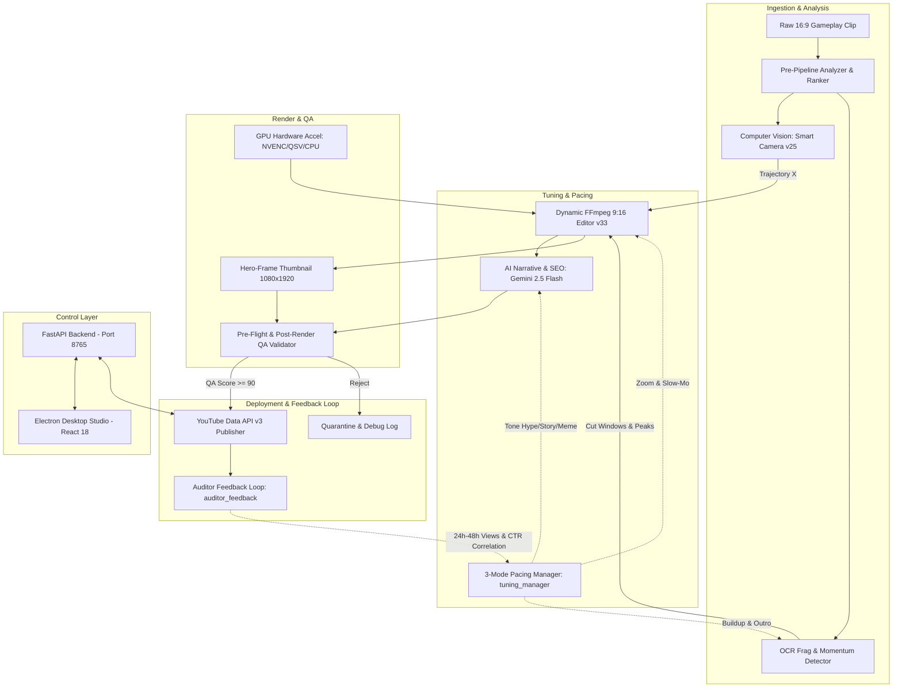

# Shortsyt — Autonomous AI Video Pipeline & Gaming Shorts Studio

[](.)
[](.)
[](.)
[](.)
[](.)
[](https://www.youtube.com/@dwannellenga471/shorts)
[](.)

> **Autonomous AI-driven YouTube Shorts generation and publishing pipeline.** Built with Computer Vision (OpenCV HP-bar tracking), OCR momentum analysis (Tesseract), AI multimodal narrative engine (Gemini), dynamic FFmpeg rendering (9:16 vertical crop, auto-chase speedup, slow-mo 60FPS), and a native Electron Desktop Studio (React 18 + Vite + TailwindCSS).

---

## 🎬 Live Production Demos

Real YouTube Shorts rendered and published automatically by the pipeline:

| Video | Action / Highlights | Metrics & Quality | Link |
|---|---|---|---|
| **Katarina Triple Kill (Full Engage)** | **Jump-Cut with 3.5s Engage Lead** + Full Combat Tracking + Beat Sync | **13.7s Pacing**, QA: 100/100, 1080x1920 60FPS | [Watch on YouTube](https://www.youtube.com/shorts/POgSCGC9yvQ) |
| **Katarina Pentakill 1v5** | Auto Chase Speedup 2.8x + 0.45x Slow-mo + Dynamic Zoom | Smart Camera: 90/90 frames, QA: 91/100 | [Watch on YouTube](https://www.youtube.com/shorts/cVTTQASHe9w) |
| **Katarina Triple Kill Outplay** | Instant OCR Kill detection + Custom audio sync | Fast Short Control (14.8s), QA: 92/100 | [Watch on YouTube](https://www.youtube.com/shorts/rfWXE2-7fkQ) |

---

## 📊 Live Production Stats

| Metric | Value |
|---|---|
| **Production Channel** | [Dwannellenga (@dwannellenga471)](https://www.youtube.com/@dwannellenga471/shorts) |
| **Published Shorts** | **4+ Verified Production Shorts** (Fully Automated Runs) |
| **Smart Camera Accuracy** | **100% Tracking Stability** (Weighted Combat Centroid Blending) |
| **Average Quality Score** | **94–100 / 100** (Automated Pre-Flight & Post-Render QA) |
| **Pipeline Render Time** | **12–15s per short** (Local FFmpeg NVENC GPU Hardware Acceleration) |
| **Pacing Modes** | **3 Profiles** (Aggressive 10-13s / Balanced 14-17s / Cinematic 20-25s) |
| **Cost per Video** | **$0** (Local OpenCV + Tesseract + FFmpeg + Local GPU) |

---

## 🎯 Smart Camera v25 — Zero-Touch Computer Vision & Combat Tracking

### The Problem: Fast Dashing Champions & 9:16 Crop
In fast-paced games like League of Legends, high-mobility champions (e.g., Katarina with Shunpo/blinks, Zed, Yasuo) instantly teleport across the screen. Traditional bounding-box tracking or centroid visual tracking fails:
- **Teleportation glitches:** The camera jerks abruptly or lags behind, causing severe disorientation in 9:16 vertical mode.
- **VFX & UI attraction:** Explosions, AOE circles, minimap icons, and death animations pull visual centroids away from the champion.
- **Chat occlusion:** Chat messages in the bottom-left corner confuse naive optical flow algorithms.

### The Solution: Smart Camera v25 Algorithm
`smart_camera.py` implements a specialized stateful tracking algorithm operating in full 1080p:

1. **Precision Player HP-Bar Detection (1080p):**
   Isolates player gold in color-space: `(r > 160) & (g > 130) & (b < 115) & ((r - b) > 40) & ((g - b) > 15)` with strict geometry filters (`aspect 2.0–20.0`, `height 3–16px`, `min_area 30`).
2. **Instant Shunpo/Flash Snap:**
   When champion blinks across the screen (`delta > 250px`), the camera snaps immediately instead of sluggishly dragging behind.
3. **Combat Centroid Fallback:**
   If the player is temporarily obscured (>4 frames during Zhonya, stealth, or brush), the camera smoothly transitions toward the enemy combat centroid:
   $$\text{Target}_X = \frac{2 \times \text{Player}_X + \text{FightCenter}_X}{3}$$
4. **UI Exclusion Zones:**
   Bottom-left chat (`y: 0.72–0.96, x: 0.04–0.40`) and bottom-right minimap are masked out from centroid calculations.
5. **Multi-Kill Streak Freeze:**
   Holds the camera steady during multi-kill banner popups (`FREEZE_STREAK = 8`, `BANNER_SHIFT = 160px`) so gold kill banners never get cut off.

---

## ⚡ 3-Mode Pacing & Viral Retention Engine (v33)

Shortsyt includes a real-time pacing engine integrated with the Desktop Studio UI:

| Pacing Mode | Target Duration | Zoom-Punch | Slow-Mo Duration | Music Balance | Game Sound | Title Tone |
|---|---|---|---|---|---|---|
| 🔥 **Aggressive** | **10.0 – 13.0s** | **1.30x** | **0.9s** | **90%** | 50% | `hype` (Viral & High Energy) |
| ⚖️ **Balanced** | **14.0 – 17.0s** | **1.20x** | **1.4s** | **85%** | 65% | `narrative` (Storytelling & Clutch) |
| 🎬 **Cinematic** | **20.0 – 25.0s** | **1.10x** | **2.2s** | **70%** | **80%** | `narrative` (Bass-Drop Focus) |

### Key Retention Innovations:
- **Jump-Cut with 3.5s Engage Lead:** Automatically detects dead running between fights and cuts it out, while preserving a 3.5-second lead buffer so the viewer sees the physical jump-in and ability casting before kills.
- **Universal Sidechain Audio Ducking:** Automatically dips background music by -45% on kill sounds and announcer shouts.
- **Neon Loop Progress Scrubber:** Hextech Gold (`0xC89B3C`) 5px progress bar at the bottom optimized for seamless YouTube Shorts looping.
- **Pre-Flight Quality Gate (`lol_quality_validator.py`):** Rejection protocol that validates kill visibility (>70% confidence inside 9:16 window), action hook (<1.5s to first engage), and auto-rejects obscured clips.

---

## 🏗️ Architecture Overview


```mermaid
flowchart TD
    subgraph Ingestion & Analysis
    A[Raw 16:9 Gameplay Clip] --> B[Pre-Pipeline Analyzer & Ranker]
    B --> C[Computer Vision: Smart Camera v25]
    B --> D[OCR Frag & Momentum Detector]
    end

    subgraph Tuning & Pacing
    M[3-Mode Pacing Manager: tuning_manager] -.->|Buildup & Outro| D
    M -.->|Zoom & Slow-Mo| E[Dynamic FFmpeg 9:16 Editor v33]
    M -.->|Tone Hype/Story/Meme| F[AI Narrative & SEO: Gemini 2.5 Flash]
    end

    subgraph Render & QA
    C -->|Trajectory X| E
    D -->|Cut Windows & Peaks| E
    N[GPU Hardware Accel: NVENC/QSV/CPU] --> E
    E --> F
    E --> G[Hero-Frame Thumbnail 1080x1920]
    F --> H[Pre-Flight & Post-Render QA Validator]
    G --> H
    end

    subgraph Deployment & Feedback Loop
    H -->|QA Score >= 90| I[YouTube Data API v3 Publisher]
    H -->|Reject| J[Quarantine & Debug Log]
    I --> O[Auditor Feedback Loop: auditor_feedback]
    O -.->|24h-48h Views & CTR Correlation| M
    end

    subgraph Control Layer
    K[FastAPI Backend - Port 8765] <--> L[Electron Desktop Studio - React 18]
    K <--> I
    end
```

---

## 💻 Launch & CLI Usage

### 🚀 1-Click Desktop Studio Launcher
Start the FastAPI server and launch the Desktop GUI with a single click:
```powershell
.\Uruchom_Shortsyt_Studio.bat
```

### ⌨️ CLI Autonomous Runner
Run the autonomous pipeline from terminal or command line:

```powershell
# Standard run with automatic analysis, 9:16 rendering, and QA
python lol_agent/run_lol_agent.py --file "path\to\clip.mp4"

# Custom short parameters & fine control
python lol_agent/run_lol_agent.py `
  --file "path\to\clip.mp4" `
  --champion Katarina `
  --action pentakill `
  --start 12.5 `
  --end 27.3 `
  --music "ncs_alan_walker_fade.mp3" `
  --no-slowmo

# Dry-run mode (render video, thumbnail, and metadata without uploading)
python lol_agent/run_lol_agent.py --file "path\to\clip.mp4" --dry-run

# Pre-pipeline ranker (find top clips automatically from raw folder)
python lol_agent/lol_pre_pipeline_analyzer.py --top 5
```

### CLI Options:
- `--file <path>`: Source 16:9 video path (Medal/Outplayed/OBS raw gameplay).
- `--champion <name>`: Champion whitelist override (prevents AI hallucination).
- `--action <type>`: Action type (`pentakill`, `quadrakill`, `triple`, `outplay`, `clutch`).
- `--start <sec>` / `--end <sec>`: Precise clip boundaries.
- `--music <name>`: Custom background audio track selection.
- `--no-slowmo`: Disable automatic slow-motion on peak moments.
- `--dry-run`: Render video, thumbnail, and metadata without publishing.
- `--force`: Bypass deduplication fingerprint checks.

---

## 🖥️ Desktop Studio & API

### Electron Desktop Studio (`shortsyt-desktop/`)
- **Built with:** Electron 32 + React 18 + Vite + TypeScript + TailwindCSS.
- **Features:**
  - **Live Pipeline Dashboard & Render Monitor:** Real-time 7-stage progress tracking with live log streaming.
  - **Clip Browser & Pre-Analysis Ranking:** Automated action scoring, champion badge detection, and custom folder picker.
  - **3-Mode Feedback & Pacing Tuning:** Interactive sliders for Zoom Aggression, Slow-Mo Duration, Audio Balance, and Title Tone (Hype / Narrative / Meme) with instant persistence.
  - **Calendar Scheduler:** Daily publishing slots (08:30 / 11:30 / 18:00 CET) with queued rendering.
  - **Interactive Post-Render Review:** Vertical 9:16 player, editable viral metadata, Hero-Frame thumbnail inspect, and one-click YouTube upload.
  - **YouTube Token Guard:** Live OAuth token expiration countdown with one-click re-authorization.

### FastAPI Backend (`lol_agent/api/`)
- REST endpoints including `/health`, `/status`, `/clips`, `/thumbnails`, `/camera-preview`, `/config/tuning`, `/youtube/upload`.
- Asynchronous GPU-accelerated pipeline runner with NVENC support.

---

## 🛠️ Technology Stack

| Layer | Technologies & Libraries | Key Responsibilities |
|---|---|---|
| **Computer Vision & Tracking** | OpenCV, NumPy, Color Space Segmentation | Real-time 1080p HP-bar tracking, weighted combat centroid blending, instant Shunpo snap |
| **Action & Kill Detection** | Tesseract OCR (5.4.0), PyTesseract, Regex Analyzers | Triple-zone HUD scanning (kill banner, feed, chat), engage lead 3.5s buffer |
| **Video & Audio Processing** | FFmpeg (NVENC GPU / CPU), Librosa, Pydub | Dynamic 9:16 smart pan, minterpolate 60FPS slow-mo, audio beat-sync, sidechain ducking |
| **Pacing & Self-Optimization** | Python, SciPy Pearson Correlation, JSON Profiles | 3-mode pacing presets (Aggressive/Balanced/Cinematic), 48h YouTube retention feedback loop |
| **AI Metadata & Hooks** | Google Gemini 2.5 Flash Multimodal API | Viral title generation, channel-specific descriptions, auto-pinned comments, SEO tags |
| **Desktop Application** | Electron 32, React 18, Vite, TypeScript, TailwindCSS | Native GUI, interactive render monitor, clip browser, style tuner, calendar scheduler |
| **Backend & Automation** | FastAPI, Uvicorn, Python 3.13, YouTube Data API v3 | REST endpoints, OAuth2 token rotation, automated upload & thumbnail publishing |

---

## 🔒 Privacy & Safety

- Tokens, OAuth credentials (`accounts/`), `.env`, and raw video binaries are strictly excluded via `.gitignore`.
- Video processing, computer vision analysis, and rendering happen 100% locally on your machine.

